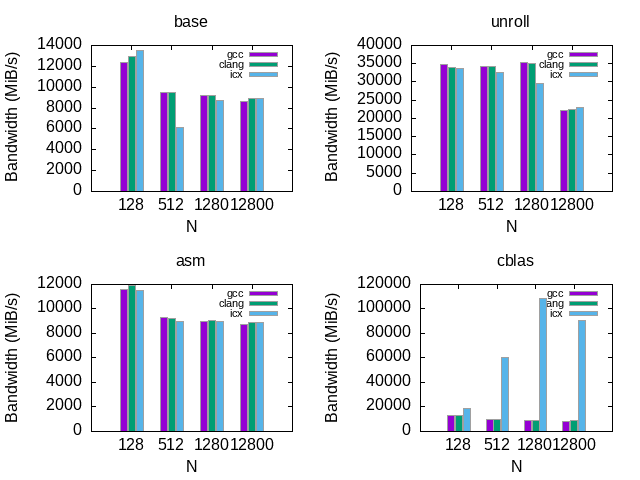
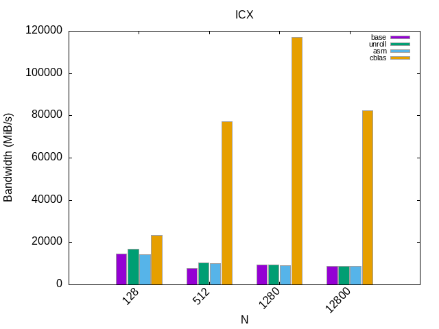

# **OBHPC TD2** : Performance measurement for dgemm, dotprod and reduc

## **Introduction**

The objective of this TP is to discover what performance measurement is. To do this, we must to use 3 basic functions and use their implementations. From the most basic to optimized versions, we have to implement and measure dgemm, reduc and dotprod.  

For this TP, we must show our results, written in C or assembler, with gnuplot.
  
## **Dependencies**

- ICX compiler [intel compiler](https://www.intel.com/content/www/us/en/developer/tools/oneapi/base-toolkit-download.html)
- CBLAS 
- Gnuplot
- cpupower

To download all dependencies, first look on repositories

## **CPU**

To compare all data collected, we have to know what the CPU is. According to it's features, datas can evolved. It's why, as we want all the time the same data, i prepared a script to collect the right information about the CPU. 
To run this script, `./cpu_info.sh CPU_NAME` and give it the name of the CPU  
ex : `./cpu_info.sh i7_6700k` and datas will save in **i7_6700k.txt**


## **Test**

Unit tests have been implemented to easily check the functions.  
To try them, run `make test` in the root repertory of the project

## **Run project**

Before running this project,chect that the cpu frequency is stable by using cpupower  
`sudo cpupower frequency-info`  
if you have the option userspace in gouvernor, run  
`sudo cpupower frequency-set -f FREQ` where FREQ is the higher frequency avaible.  
else run  
`sudo cpupower frequency-set -g performance` 
To run the project, first verify that you own the dependencies !   
After you only have to run the script `./script.sh`  
when this will be done, run the gnuplot script with your CPU name.   
Example :`./gnuplot_one.sh i7-1165G7` 

## **Dotprod**

basic implementation  
```c
double dotprod_base(double *restrict a, double *restrict b, long long n)
{
  double d = 0.0;
  
  for (long long i = 0; i < n; i++)
    d += a[i] * b[i];

  return d;
}
```

## **Reduc**

basic implementation  
```c
double reduc_base(double *restrict a, long long n)
{
  double d = 0.0;
  
  for (long long i = 0; i < n; i++)
    d += a[i];

  return d;
}
```

## **Dgemm**

basic implementation  
```c
void dgemm_ijk(double *restrict a, double *restrict b, double *restrict c, long long n)
{
  for (long long i = 0; i < n; i++)
    for (long long j = 0; j < n; j++)
      for (long long k = 0; k < n; k++)
	c[i * n + j] += a[i * n + k] * b[k * n + j];
}
```

## Example :
### Different function of Dotprod w O1 flag on I7 1165G7


### Different function of dgemm w ICX compiler and O3 flag on I7 1165G7 and I5 3570
