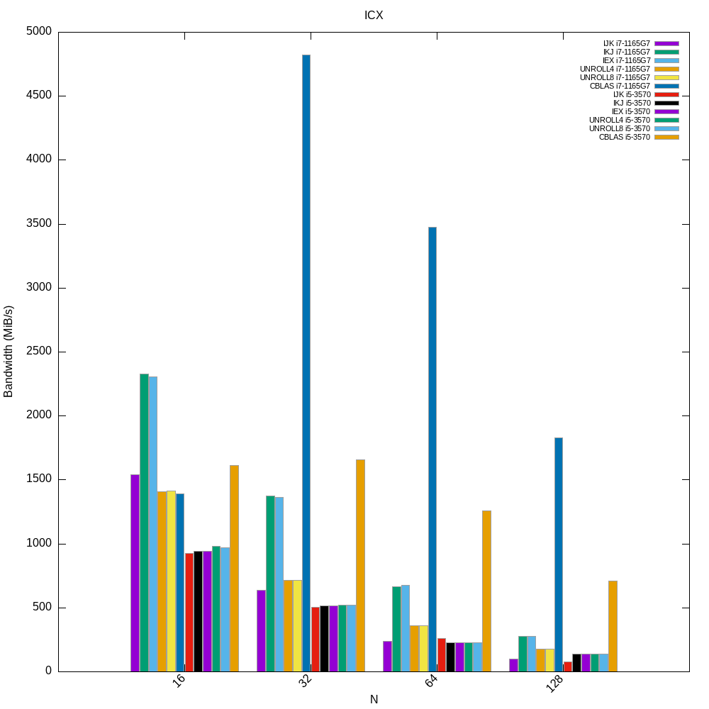

# TD2 OBHPC

## Dependancies
- ICX compiler [intel compiler](https://www.intel.com/content/www/us/en/developer/tools/oneapi/base-toolkit-download.html)
- CBLAS 
- Gnuplot

To download all dependancies, first look on repositories

## Tests
Unit tests have been implemented to easily check the functions.  
To try them, run `make test` in the root repertory of the project

## Run project

To run the project, first verify that you own the dependancies !   
After you only have to run the script `./script.sh`  
when this will be done, run the gnuplot script with your CPU name.   
Example :`./gnuplot_one.sh i7-1165G7` 

## CPU
To compare all data collected, we have to know what the CPU is. According to it's features, datas can evolved. It's why, as we want all the time the same data, i prepared a script to collect the right information about the CPU. 
To run this script, `./cpu_info.sh CPU_NAME` and give it the name of the CPU  
ex : `./cpu_info.sh i7_6700k` and datas will save in **i7_6700k.txt**

## All implementations :
### Dotprod
basic implementation  
unroll8 implementation  
assembler implementation  
cblas implementation

### Reduc
basic implementation  
unroll8 implementation  
assembler implementation  
cblas implementation

### Dgemm
basic (ijk) implementation  
basic optimisez (ikj) implementation  
basic optimisez (iex) implementation  
unroll4 implementation  
unroll8 implementation  
cblas implementation

## Example :
### Different function of Dotprod w O1 flag on I7 1165G7

### Different function of Reduc w ICX compiler and O3 flag on I7 1165G7

